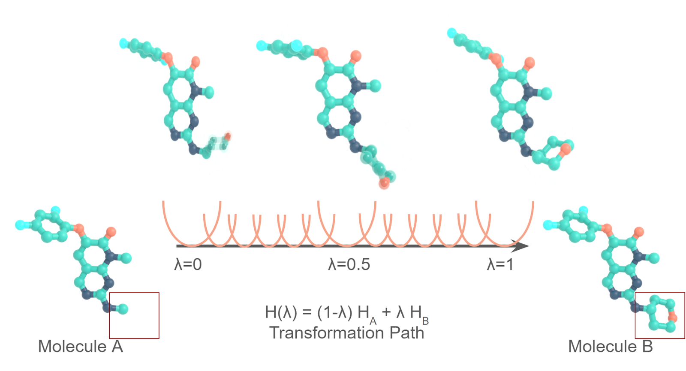

Relative Free Energy Calculation Setup: About mapping atoms with Kartograf
==================================================================================================================

In drug design or material sciences, thermodynamic properties of molecules are
important guidelines in the design. One example of such a property is free
energy, giving the likelihood of a given state to occur. More explicitly, we are
interested in relative free energies, comparing two states and the likelihoods
of those. In drug design, such a free energy difference between two different
drug candidate molecules might be measured experimentally in labs as the IC50 or
the kD, which describe the strength of the interaction between the molecule and
some target biomolecule (usualy a protein). For example, these quantities can be
used to estimate the potency of a small molecule to inhibit an enzyme, a
fundamental mechanism in many drug design projects. In silico approaches like,
for example, relative alchemical free energy calculations, can be used to reduce
the required experiments, boosting the drug discovery process and reducing the
required resources. In such approaches, small molecules binding to an enzyme are
compared in computer simulations utilizing special molecular dynamics
simulations. These simulations yield relative binding free energies (RBFE),
directly giving insights into the molecules’ structure-function relationship.

A lot of research has been conducted on such methods, showing great potential
for many different use cases. We at OpenFE want to make the methods accessible
to the public in an open source fashion, allowing easy setup, simulation
execution and analysis of the free energy calculation methods. In this blog
post, we will focus on RBFE calculation setup and give insights into one of the
fundamental steps in the simulation process. Keep in mind that there are many
different approaches out there, which we would like to cover in later posts.
Atom mappings and their use for RBFEs

Recently we published an article in [JCTC about Kartograf ](https://pubs.acs.org/doi/10.1021/acs.jctc.3c01206), a new atom mapping
algorithm, based on an old idea. This is a very nice chemoinformatics problem,
but you might want to ask, what does it have to do with RBFEs?



## RBFE Simulations and how to represent the alchemical molecule change
In RBFE simulations, two small molecules of interest are simultaneously
simulated in a given environment (the protein or the water box). The
contributions of the different molecules in the simulation are slowly turned
from one molecule to the other (in steps like molA 100% / molB 0%; molA 90% / 
molB 10%; molA 80% / molB 20%; … molA 0% / molB 100%)

One question is, how should those molecules be represented in the simulation?
There are many different approaches out there that answer this question slightly
differently. The RBFE protocol, which was developed by the [Perses](https://github.com/choderalab/perses) team and 
which
is present in OpenFE, uses hybrid-topology approaches. In those representations,
the two molecules always should be able to share a common core (some chemical
structure that is the same). This common core is represented by the identical
set of atoms and is usually represented by the maximum common substructure (
MCS). Every atom outside of the common core is represented independently of each
other. This approach is very efficient, by not adding to many independent atoms,
but also not limiting the present atoms too much. But as we want to be able to
build these hybrid topology representations automatically, we need an algorithm
that can find the common core for us.


## Atom Mappers
Existing solutions in this area (for example [Lomap](https://github.
com/OpenFreeEnergy/Lomap/blob/main/lomap/mcs.py), [fesetup](https://github.com/CCPBioSim/fesetup/blob/master/cheapmap.py), and 
[timemachine](https://github.com/proteneer/timemachine/blob/master/timemachine/fe/atom_mapping.py))
all use subgraph-matching based approaches to finding the MCS between two
molecules. A good explanation of how these algorithms work is given by Andrew
Dalke [here](https://www.dalkescientific.com/writings/diary/archive/2012/05/12/mcs_background.html). In general they can be said to first work on the 2D structures (
ignoring their positions) then later filter to include this information.

### Short Peak on Kartograf Theory
Kartograf departs from this approach and instead primarily focuses on the
coordinates of the two molecules to find the MCS, an idea that was developed
thanks to conversations with [old colleagues](https://www.nextmovesoftware).
com). This alternative approach is
possible thanks to the fact that, for hybrid-topology approaches used in RBFEs,
the molecules are already spatially superimposed. First we can calculate the
distance between all pairs of atoms in between the two small molecules, which,
after we discard distances larger than a threshold, can be viewed as a weighted
bipartite graph. At this point the problem can be solved as an [assignment
problem](https://en.wikipedia.org/wiki/Assignment_problem), where the distance matrix between the two small molecules form a
weighted bipartite graph, which we solve using the [linear sum assignment](https://docs.scipy.org/doc/scipy/reference/generated/scipy.optimize.linear_sum_assignment.html)
implementation in scipy. While linear sum assignments can theoretically scale
poorly, the tight distance maximum cutoff produces a very sparse input graph to
be solved. Once this initial solution is created, some filtering based on
chemistry constraints is then applied.


reproduced from [](https://pubs.acs.org/doi/10.1021/acs.jctc.3c01206)
# How To Use Kartograf?

Let’s have a look at how Kartograf works!
First we want to generate two molecules, that shall be mapped onto each other.
To generate two molecules we use RDKit and

## How to install:
First we need to install the package!

You can install the package with [PyPi](https://pypi.org/project/kartograf/):
```bash
pip install kartograf
```

Or you can simply install ith with [conda](https://anaconda.org/conda-forge/kartograf):
```bash
conda install -c conda-forge kartograf openfe
```

The rest of this blogpost was written with kartograf v1.1 and openfe v1.0 in
mind!

## How to generate an Atom Mapping
Let's Start the journey with generating some input molecules, we will use 
for our atom mapping adventure.
```python
from rdkit import Chem

## Preprocessing from Smiles - Here you can add your Input instead!
smiles = ["c1ccccc1", "c1ccccc1(CO)"]
rdmols = [Chem.MolFromSmiles(s) for s in smiles]
rdmols = [Chem.AddHs(m, addCoords=True) for m in rdmols]
[Chem.rdDistGeom.EmbedMolecule(m, useRandomCoords=False, randomSeed = 0) for m in rdmols]
```

After generating the molecules as rdkit mols, we convert them to gufe
Components. These Components, can be read and used everywhere in the OpenFE
environment, they are part of the universal OpenFE language and can be
translated in many other languages.

```python
# Build Small Molecule Components
molA, molB = [SmallMoleculeComponent.from_rdkit(m) for m in rdmols]
```

Now we have two molecules with 3D coordinates, that we can use further for
finding the atom mapping of the MCS. As mentioned before Kartograf assumes, that
the molecules are well aligned, in order to find an atom mapping of the MCS. In
our case, we have generated two molecules with independent coordinate spaces.
With the alignment helper functions of kartograf, we can now generate a high
coordinate overlap for our molecules. Here we use a helper for shape alignments
from rdkit (link)

```python
## Align the mols first - this might not needed, depends on input.
a_molB = align_mol_shape(molB, ref_mol=molA)
```
Now we can start the mapping, let’s first build a mapper object:

```python
# Build Kartograf Atom Mapper

mapper = KartografAtomMapper(atom_max_distance: float = 0.95,
atom_map_hydrogens: bool = True,
map_hydrogens_on_hydrogens_only: bool = False,
map_exact_ring_matches_only: bool = True,
additional_mapping_filter_functions: Optional[Iterable[Callable[[
Chem.Mol, Chem.Mol, dict[int, int]], dict[int, int]]]] = None,
)
```
A variety of settings can be set here:
* **atom_max_distance : float** - geometric criteria for two atoms, how 
far their distance can be maximal (in Angstrom). Default 0.95
* **map_hydrogens_on_hydrogens_only : bool** - 
            map hydrogens only on hydrogens. Default False
* **map_exact_ring_matches_only : bool** - if true, only rings 
  with matching ringsize and same bond-orders
            will be mapped. Additionally no ring-breaking is permitted. default
            False
* **additional_mapping_filter_functions : Iterable[Callable[[Chem.Mol,
        Chem.Mol, Dict[int, int]], Dict[int, int]]]** - with this optional parameter you can further filter the distance
            based mappings with your own custom filters, provided as iterables.
            as default we suggest to avoid ring size/breaking changes and only
            allow whole rings to be mapped. This option will be explained in 
  more detail further down.


Let’s map the molecules with:
```python
kartograf_mapping = next(mapper.suggest_mappings(molA, a_molB))
```

If you use this code in a jupyter notebook, you can checkout the atom mapping in
2D by simply executing the following cell:
```python
kartograf_mapping
```


Note that the 2D mapping might give wrong impressions of the mapping.

But you can also look at the mapping in 3D with:
```python
from kartograf.utils.mapping_visualization_widget import display_mappings_3d
display_mappings_3d(mappings)
```


This visualization is important because you can see the coordinate influence on
the atom mapping directly and most accurate.

## How can we build atom mappings with additional rules?
Code example of kartograf w/ custom filters

Here we start with a custom filter:
```python
def custom_filter(
molA: Chem.Mol, molB: Chem.Mol, mapping: dict[int, int]
) -> dict[int, int]:
filtered_mapping = {}

    #do something, but always return a dict with the filtered mapping!

    return filtered_mapping
```

After this, let’s use this new filter:
```python
from kartograf import KartografAtomMapper

# Build Kartograf Atom Mapper

mapper = KartografAtomMapper(additional_mapping_filter_functions=[filter_element_changes])

Let’s map the molecules from the prior example again:
kartograf_mapping = next(mapper.suggest_mappings(molA, a_molB))
kartograf_mapping
```


And here the 3D representation:


Some of these Filters are already pre-implemented and can be found
here (<link>):

```python
from kargoraf.filters import (filter_atoms_h_only_h_mapped,
filter_element_changes,
filter_hybridization_changes,
filter_ringsize_changes,
filter_ringbreak_changes,
filter_whole_rings_only,
)
```

## Can I use Kartograf directly from OpenFE?
The kartograf tool has been integrated into the openfe ecosystem and can be
included into workflows when planning RBFE networks. From the command line, the
[`openfe plan-rbfe-network`](https://docs.openfree.
energy/en/stable/reference/cli/plan_rbfe_network.html) command can take a yaml file to customise the
algorithms used.

```json
mapper:
method: KartografAtomMapper
settings:
atom_max_distance: 1.0
atom_map_hydrogens: false

network:
method: generate_minimal_spanning_network
```

This `settings.yaml` will select the `KartografAtomMapper`, with some customised
parameters to be used in planning a minimal spanning network.
[link](https://docs.openfree.energy/en/latest/tutorials/rbfe_cli_tutorial).
html#customize-you-campaign-setup)


wrap up

This work is licensed under CC BY 4.0 